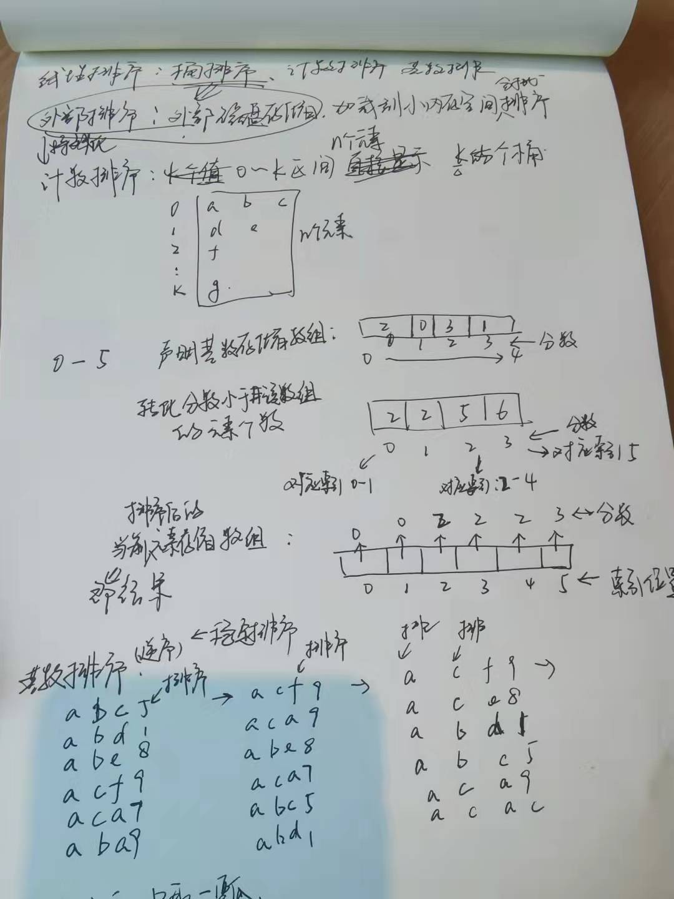
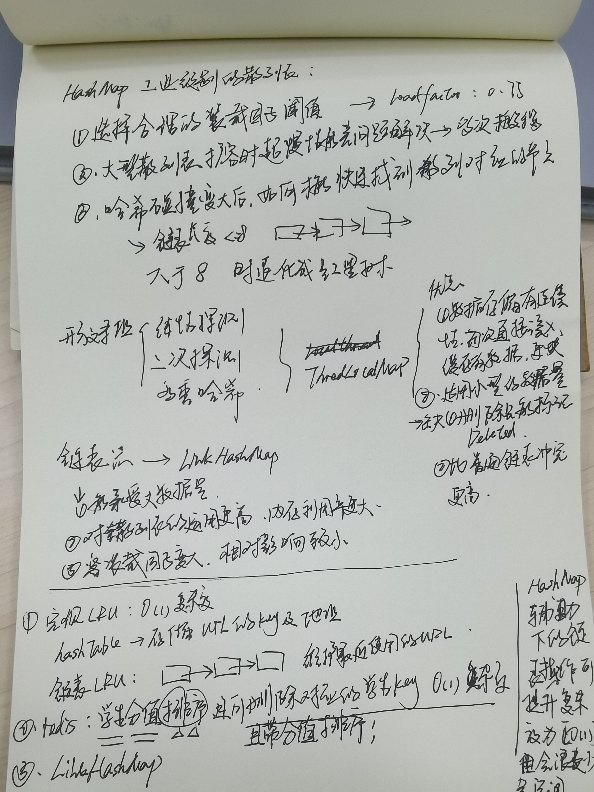

# 数据结构算法之美

## 1. 排序：桶排序、计数排序、基数排序

## 2. 散列表

## 3. 字符串知识补充

#### 1. 常用的操作方法

- s.length() length()是一个方法，而不是一个成员变量！
- s.substring(beginIndex, endIndex); 此时截取的长度 = endIndex - beginIndex; 注意beginIndex 开始后到 长度的个数；
- s.charAt(index); 使用的是方法！
- s.trim() 去除空格；
- 
